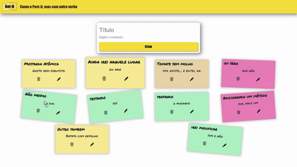

# Get-it
### Projeto de Tecnologias Web

 <center></center>

Simples aplicação para criar,arrastar editar e excluir pequenas anotações dinâmicas no formato clássico de um Post-it. 

Para executar, execute sequencialmente:
```bash
git clone https://github.com/matheus-1618/Get-it

cd Get-it

python servidor.py
```

### Professora: Bárbara Tieko

 ©Insper, 4° Semestre Engenharia da Computação, Tecnologias Web.
